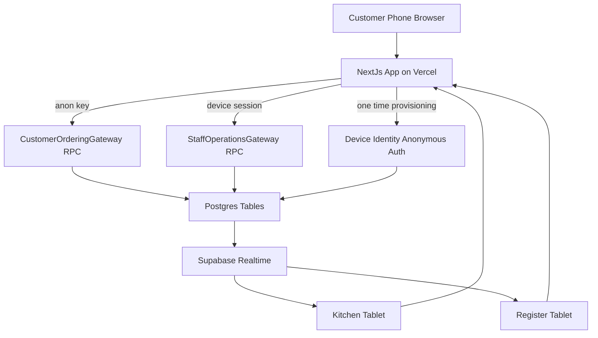
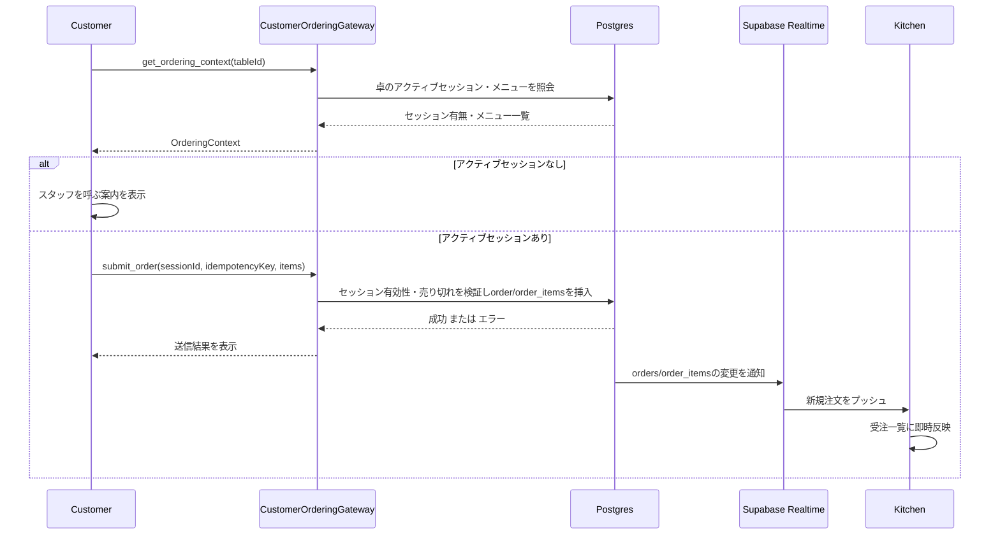
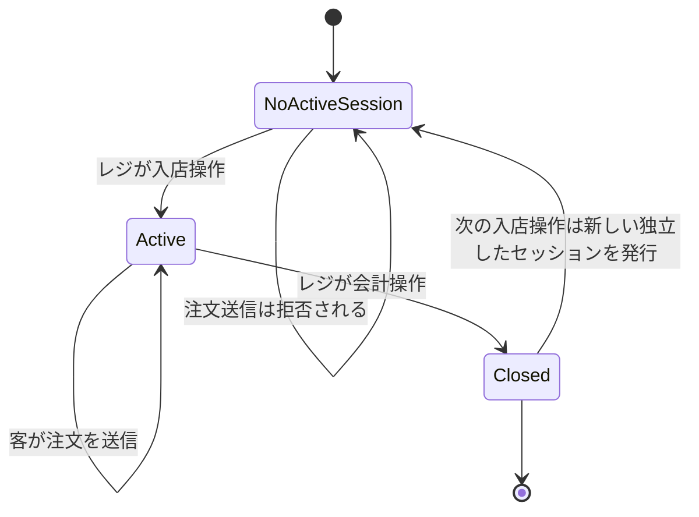
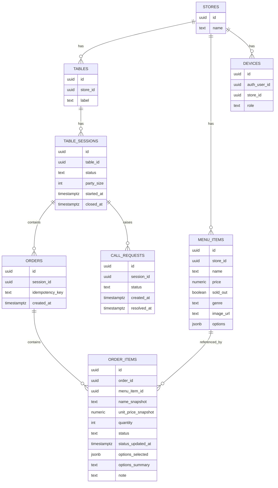

# Technical Design: table-order-kitchen

## Overview

**Purpose**: 本specは、客の卓側QR注文、厨房でのリアルタイム受注・調理ステータス管理・売り切れ登録、レジでの入退店（来店セッション）管理と卓別会計確認、および呼び出しボタンを実現する。これにより、手書き伝票による注文伝達と手計算での会計を、リアルタイムかつ整合性の取れた仕組みに置き換える。

**Users**: 客（自分のスマートフォンでQR注文）、厨房スタッフ（厨房設置タブレットでKDSを操作）、レジスタッフ（レジ設置タブレットで入退店・会計確認を操作）が、それぞれ個人ログインなしで利用する。

**Impact**: 新規構築（グリーンフィールド）。既存システムはない。

### Goals
- 客の注文を数秒以内に厨房へリアルタイム表示する
- 卓固定QRコードの使い回しによる注文・会計の混同を、DBレベルの制約で構造的に防止する
- 客・厨房・レジ通常モードを個人ログインなしで安全に運用できる認証境界を確立する
- 将来のオーナーモードspec（商品登録・売上管理）が本specの認証基盤を作り直さずに済むようにする

### Non-Goals
- 商品登録・価格変更・売上管理（オーナーモード、別spec）
- 決済処理・支払記録そのもの（金額の表示・集計までがスコープ）
- 多言語対応、複数店舗を横断する管理UI
- 卓自体の登録・QRコード発行機能（初期データは移行作業として本spec範囲外で投入する）

## Boundary Commitments

### This Spec Owns
- 客向け注文受付（メニュー表示・品目写真・注文オプション選択・注文送信、呼び出し送信）とその境界チェック（アクティブセッションの有無、売り切れ判定）、および確定注文合計の表示
- 来店セッションのライフサイクルとその整合性ルール（卓ごとに高々1つのアクティブセッション、終了後の注文拒否、履歴保持、新規セッションの独立ID発行）
- 厨房向けの品目単位の受注表示・調理ステータス更新（ジャンルに応じた状態遷移、一品の優先表示とショートカット）・売り切れ登録
- レジ向けの入退店操作（人数記録を伴うセッション開始/終了）、全卓状況の一覧表示、卓別会計確認表示、およびレジからの注文品目の追加・削除・ステータス変更（いずれも実行前の確認を伴う）
- 客・厨房・レジ通常モードの無ログインアクセス境界と、それを支えるデバイス識別基盤（匿名セッション＋`device_role`カスタムクレーム）

### Out of Boundary
- オーナーモード（商品登録・価格変更・売上管理）。本specは`owner_mode`というJWTクレーム名前空間のみを予約し、実装は行わない
- 決済処理・支払記録。現金/カード等の実際の授受はスタッフが本システム外で行う
- 卓自体の登録・QRコード発行機能。`stores`/`tables`の初期データは本spec範囲外の手動投入作業として扱う
- 多言語対応、複数店舗横断の管理機能

### Allowed Dependencies
- Supabase管理下のPostgres／Auth／Realtime（`.kiro/steering/tech.md`の方針）
- Vercelでホストされる単一Next.jsプロジェクト内の他ロール別ルート（将来のオーナーモードは同一プロジェクトの別ルートとして追加される想定）

### Revalidation Triggers
- `device_role` / `owner_mode` のJWTクレーム構造を変更する場合
- `table_sessions` / `order_items` のスキーマ（特に`status`列挙値やユニーク制約）、または`menu_items.genre`とジャンル別の許可遷移表を変更する場合
- `CustomerOrderingGateway` / `StaffOperationsGateway` の関数シグネチャを変更する場合
- 卓登録・QRコード発行機能を別specで追加し、`tables`テーブルへの新しい書き込み経路が生まれる場合

## Architecture

### Architecture Pattern & Boundary Map



**Architecture Integration**:
- **Selected pattern**: RPC集約型BaaSアーキテクチャ。フロントエンド（Next.js）はSupabaseへ直接接続し、独自のAPIサーバー層は持たない
- **Domain/feature boundaries**: 客向け操作は`CustomerOrderingGateway`、厨房/レジ向け操作は`StaffOperationsGateway`という2系統のPostgres RPC関数群に完全に分離する。生テーブルへの直接書き込みは許可しない
- **New components rationale**: `DeviceIdentityProvider`（匿名認証＋カスタムクレーム）は、個人ログインなしで厨房/レジの操作を保護するために必要。詳細は`research.md`のDesign Decisionsを参照
- **Steering compliance**: `.kiro/steering/tech.md`のBaaS中心・一人運用前提の方針に準拠。独自バックエンドサーバーを追加しない

### Technology Stack

| Layer | Choice / Version | Role in Feature | Notes |
|-------|------------------|-----------------|-------|
| Frontend | Next.js（App Router）, TypeScript | `/order/[tableId]`・`/kitchen`・`/register`の3ルートを1プロジェクトで実装 | 客向けはPWA化 |
| Backend / Business Logic | PostgreSQL関数（SECURITY DEFINER RPC） | セッション整合性・注文受付・売り切れ登録・呼び出し管理を原子的に実行 | 独自APIサーバーは持たない |
| Data | Supabase Postgres | `stores`/`tables`/`table_sessions`/`menu_items`/`orders`/`order_items`/`call_requests`/`devices` | 全テーブルRLS有効化、直接grantは最小限 |
| Messaging / Realtime | Supabase Realtime（`postgres_changes`） | 注文・ステータス・呼び出しの変更を厨房/レジへ即時配信 | 本規模ではBroadcast移行閾値に達しない（`research.md`参照） |
| Auth | Supabase Auth（Anonymous Sign-ins + Custom Access Token Hook） | 厨房/レジのデバイス識別のみに使用。客側は認証なし | `owner_mode`クレームは名前空間のみ予約 |
| Infrastructure | Vercel（フロントエンド）, Supabase管理クラウド（バックエンド） | 従量課金・スケールゼロ | `.kiro/steering/tech.md`と一致 |

## File Structure Plan

### Directory Structure
```
src/
├── app/
│   ├── order/[tableId]/
│   │   └── page.tsx              # 客向け注文画面（メニュー表示・カート・呼び出しボタン）
│   ├── kitchen/
│   │   └── page.tsx              # 厨房KDS盤面（受注一覧・ステータス更新・売り切れ登録）
│   ├── register/
│   │   └── page.tsx              # レジ通常モード（入退店操作・卓別会計確認・呼び出し対応）
│   └── setup/[role]/
│       └── page.tsx              # 厨房/レジタブレットの初回デバイスプロビジョニング画面
├── lib/
│   ├── supabase/
│   │   ├── client.ts             # ブラウザ用Supabaseクライアント生成
│   │   └── database.types.ts     # Supabase CLIで生成するDB型定義
│   ├── gateways/
│   │   ├── customerOrderingGateway.ts   # CustomerOrderingGateway型付きラッパー
│   │   └── staffOperationsGateway.ts    # StaffOperationsGateway型付きラッパー
│   ├── device/
│   │   └── useDeviceIdentity.ts  # 匿名サインイン確認・device_role取得フック
│   └── realtime/
│       └── useRealtimeFeed.ts    # postgres_changes購読＋再接続時の再取得フック（厨房/レジ共用）
supabase/
├── migrations/
│   ├── 0001_schema.sql           # テーブル定義（devices, stores, tables, table_sessions, menu_items, orders, order_items, call_requests）
│   ├── 0002_rls_policies.sql     # RLS有効化・最小権限の閲覧ポリシー・生テーブルへの直接grant拒否
│   ├── 0003_rpc_customer_gateway.sql  # get_ordering_context / submit_order / create_call_request
│   ├── 0004_rpc_staff_gateway.sql     # start_session / close_session / update_order_item_status / set_sold_out / resolve_call_request / list_kitchen_feed / list_register_feed
│   └── 0005_custom_access_token_hook.sql  # device_role claimをJWTに埋め込むフック関数
```

> `order`/`kitchen`/`register`はいずれも`structure.md`の役割別ルート構成に従う。UIコンポーネント内部の細分化（メニュー一覧、カート等）は各routeディレクトリ配下に閉じるため個別列挙しない。

### Modified Files
なし（新規構築のため既存ファイルの変更はない）

## System Flows

### 注文送信〜厨房反映フロー



**Key Decisions**:
- `get_ordering_context`と`submit_order`を分離することで、注文送信の直前に必ずセッション有効性を再検証する（要件1.9を満たす）
- `idempotencyKey`により、通信リトライやボタン連打による重複注文を防ぐ（`research.md`のDesign Decisions参照）

### 来店セッションのライフサイクル



**Key Decisions**:
- `Active`状態は卓ごとに部分ユニークインデックスで高々1つに制約される（要件4.1）ため、状態遷移の矛盾はDBレベルで防止される
- `Closed`から`Active`への遷移は必ず新しいセッションIDを発行し、旧セッションの再有効化は起こり得ない（要件4.4）

## Requirements Traceability

| Requirement | Summary | Components | Interfaces | Flows |
|-------------|---------|------------|------------|-------|
| 1.1-1.4 | 客のメニュー閲覧・アクティブセッション確認 | CustomerOrderingGateway | `getOrderingContext` | 注文送信〜厨房反映フロー |
| 1.5, 1.6 | 品目写真の表示・注文オプションの選択 | CustomerOrderingGateway, Schema & RLS Foundation | `getOrderingContext`（menu_itemsの`imageUrl`/`options`） | - |
| 1.7, 1.8, 1.10 | 注文送信・オプション別の明細分離・追加注文 | CustomerOrderingGateway | `submitOrder` | 注文送信〜厨房反映フロー |
| 1.9 | 終了済みセッションへの注文拒否 | CustomerOrderingGateway, Schema & RLS Foundation | `submitOrder`（`SESSION_NOT_ACTIVE`） | 来店セッションのライフサイクル |
| 1.11 | 送信中のネットワーク断エラー表示 | CustomerOrderApp (UI) | - | - |
| 1.12 | 確定注文合計の常時表示 | CustomerOrderingGateway, RealtimeFeed | `getOrderingContext`（`confirmedTotal`） | 注文送信〜厨房反映フロー |
| 2.1-2.4 | 呼び出しボタン送信・重複防止・レジへの通知表示・対応済み処理 | CustomerOrderingGateway, StaffOperationsGateway | `createCallRequest`, `getOrderingContext`（`hasOpenCallRequest`）, `resolveCallRequest`, `listRegisterFeed`（`hasOpenCallRequest`） | 注文送信〜厨房反映フローと同型 |
| 3.1-3.4 | レジの入店（人数記録）/会計操作（確認あり）によるセッション開始・終了 | StaffOperationsGateway | `startSession`, `closeSession` | 来店セッションのライフサイクル |
| 3.5 | 来店中の人数変更（確認あり） | StaffOperationsGateway | `updatePartySize` | 来店セッションのライフサイクル |
| 4.1-4.4 | セッション整合性ルール（1卓1アクティブ・拒否・履歴保持・独立ID） | Schema & RLS Foundation, StaffOperationsGateway | `startSession`（`SESSION_ALREADY_ACTIVE`） | 来店セッションのライフサイクル |
| 5.1-5.4 | レジでの卓別会計確認表示・全卓の状況一覧 | StaffOperationsGateway | `listRegisterFeed` | 注文送信〜厨房反映フロー（Realtime経由で反映） |
| 5.5-5.7 | レジからの品目追加・削除・ステータス変更（いずれも確認あり） | StaffOperationsGateway | `addOrderItem`, `removeOrderItem`, `updateOrderItemStatus`, `listMenuItems`（5.5、タスク8.3で追加。追加対象の品目一覧） | - |
| 6.1, 6.2, 6.5, 6.8, 6.9 | 品目単位の受注表示・ステータス更新反映・卓/時刻表示・接続断対応 | StaffOperationsGateway, RealtimeFeed | `listKitchenFeed`, `updateOrderItemStatus` | 注文送信〜厨房反映フロー |
| 6.3, 6.4 | ジャンル別のステータス体系（フード/一品は3段階、ドリンクは2段階） | Schema & RLS Foundation, StaffOperationsGateway | `updateOrderItemStatus`（ジャンルに応じた遷移検証） | 品目ステータスの状態遷移 |
| 6.6, 6.7 | 一品の直接完了ショートカットと未対応リストでの優先表示 | StaffOperationsGateway | `updateOrderItemStatus`, `listKitchenFeed`（並び替え） | 品目ステータスの状態遷移 |
| 6.10 | 調理完了リストの直近完了順表示 | StaffOperationsGateway, Schema & RLS Foundation | `listKitchenFeed`（`status_updated_at`降順） | 品目ステータスの状態遷移 |
| 7.1-7.4 | 売り切れ登録・解除・既存注文への非影響 | StaffOperationsGateway | `setSoldOut`, `listMenuItems`（タスク7.4で新規追加。上記Responsibilities & Constraints参照） | - |
| 8.1-8.3 | 客/厨房/レジ通常モードの無ログイン | DeviceIdentityProvider, Schema & RLS Foundation | `ensureDeviceSession` | - |

## Components and Interfaces

| Component | Domain/Layer | Intent | Req Coverage | Key Dependencies (P0/P1) | Contracts |
|-----------|--------------|--------|---------------|---------------------------|-----------|
| Schema & RLS Foundation | Data | テーブル定義とRLSによる境界の物理的強制 | 4.1, 6.3, 6.4, 8.1-8.3 | Supabase Postgres (P0) | State |
| CustomerOrderingGateway | RPC / Backend Logic | 客向け操作（閲覧・注文・呼び出し）の唯一の書き込み経路 | 1.1-1.12, 2.1-2.3, 7.2 | Schema & RLS Foundation (P0) | Service |
| StaffOperationsGateway | RPC / Backend Logic | 厨房/レジ向け操作の唯一の書き込み経路 | 2.4, 3.1-3.5, 4.1-4.4, 5.1-5.7, 6.1-6.10, 7.1, 7.3-7.4 | Schema & RLS Foundation (P0), DeviceIdentityProvider (P0) | Service |
| DeviceIdentityProvider | Auth | 厨房/レジタブレットの匿名デバイス識別とプロビジョニング | 8.2, 8.3 | Supabase Auth (P0) | Service, State |
| RealtimeFeed | Frontend Infra | 客/厨房/レジ画面へのリアルタイム更新と再接続時の再同期 | 1.12, 6.1, 6.8, 6.9 | Supabase Realtime (P0) | Event |
| CustomerOrderApp (UI) | Presentation | 客向け注文画面。フード/一品/ドリンクのジャンル別メニュー表示とオプション選択、確定注文合計の表示を含む | 1.1-1.12, 2.1-2.2 | CustomerOrderingGateway (P0), RealtimeFeed (P1) | - |
| KitchenBoard (UI) | Presentation | 厨房画面。フードボード／ドリンクボード／売り切れボードの3タブを1台のタブレットで切り替える | 6.1-6.10, 7.1, 7.3-7.4 | StaffOperationsGateway (P0), RealtimeFeed (P0) | - |
| RegisterConsole (UI) | Presentation | レジ通常モード画面（卓マップ表示・注文管理） | 2.4, 3.1-3.5, 5.1-5.7 | StaffOperationsGateway (P0), RealtimeFeed (P1) | - |

### Data / RPC Layer

#### Schema & RLS Foundation

| Field | Detail |
|-------|--------|
| Intent | 全ドメインデータを保持し、RLSによって「RPC経由以外の書き込みを拒否する」という境界を物理的に強制する |
| Requirements | 4.1, 8.1, 8.2, 8.3 |

**Responsibilities & Constraints**
- 生テーブル（`table_sessions`, `orders`, `order_items`, `call_requests`, `menu_items`）はRLSを有効化し、`anon`/`authenticated`ロールへのINSERT/UPDATE/DELETE直接権限は付与しない
- `table_sessions`に`(table_id) WHERE status = 'active'`の部分ユニークインデックスを設け、卓あたり同時アクティブセッションを高々1つに強制する（要件4.1）
- `menu_items`のSELECTのみ`anon`に許可する（客側のメニュー表示に必要な最小権限）

**Dependencies**
- External: Supabase managed Postgres — ホスティング基盤 (P0)

**Contracts**: Service [ ] / API [ ] / Event [ ] / Batch [ ] / State [x]

##### State Management
- **State model**: `table_sessions.status`は`active` → `closed`の一方向遷移のみ。`order_items.status`はジャンルに応じた一方向遷移（フード/一品: `received → in_progress → done`、ドリンク: `received → done`。一品のみ`received → done`の直接遷移も可）（要件6.2-6.4, 6.6）
- **Persistence & consistency**: 部分ユニークインデックスとトランザクション内のRPC関数により、セッション開始の競合はDB制約違反として原子的に検出される
- **Concurrency strategy**: 同時に複数の入店操作が来た場合、後着の`start_session`呼び出しは一意制約違反を検知し`SESSION_ALREADY_ACTIVE`として処理する

**Implementation Notes**
- Integration: マイグレーションは`0001_schema.sql`〜`0002_rls_policies.sql`に分割し、スキーマとRLSポリシーを独立してレビューできるようにする
- Validation: デプロイ前に「anonロールで生テーブルへ直接INSERT/UPDATEできないこと」を結合テストで確認する（`research.md`のRisks参照）
- Risks: RLSの有効化漏れが最大のリスク。CIにRLS有効化チェックを組み込む

#### CustomerOrderingGateway

| Field | Detail |
|-------|--------|
| Intent | 客（匿名・無ログイン）が行える操作を、セッション有効性チェック込みで安全に提供する唯一の経路 |
| Requirements | 1.1-1.12, 2.1, 2.2, 2.3, 7.2 |

**Responsibilities & Constraints**
- `anon`ロールにのみ`EXECUTE`権限を付与する。生テーブルへの直接アクセス権は一切持たない
- 注文送信時は必ずサーバー側で「対象セッションが`active`か」「品目が売り切れでないか」「送信されたオプション選択が当該品目の`options`定義と整合しているか」を再検証する（クライアントの表示状態を信用しない）
- 品目に紐づく`options`（味付けの選択、わさび抜き等のトグル、グラス数等のカウンター）の定義と`imageUrl`は`getOrderingContext`のメニュー一覧に含めて返す。オプション自体の作成・編集は将来のオーナーモードspecの責務であり、本Gatewayは読み取りのみ行う
- 同一品目でもオプションの選択内容が異なれば別の注文明細として登録する（要件1.8）
- 呼び出し要求は同一セッションに未対応（`open`）のものがある場合、新規作成しない（要件2.3）
- `getOrderingContext`は、当該セッションの送信済み注文明細から計算した`confirmedTotal`（レジの`listRegisterFeed`と同一ロジック）を返す（要件1.12）
- `getOrderingContext`は、当該セッションに未対応（`open`）の呼び出しが存在するかを`hasOpenCallRequest`として返す（タスク6.3で追加、レジの`listRegisterFeed.hasOpenCallRequest`と同一ロジック）。呼び出しボタンが「対応済みになったこと」をクライアント側の推測ではなくサーバー側の再検証で検知するための唯一の経路であり、`confirmedTotal`と同じポーリングに相乗りする（要件2.1, 2.2, 2.3）

**Dependencies**
- Inbound: CustomerOrderApp (UI) — 客向け画面からの呼び出し (P0)
- Outbound: Schema & RLS Foundation — データの読み書き先 (P0)
- Outbound: RealtimeFeed — 同席者の別端末からの注文も反映した確定合計のライブ更新 (P1)

**Contracts**: Service [x] / API [ ] / Event [ ] / Batch [ ] / State [ ]

##### Service Interface
```typescript
interface CustomerOrderingGateway {
  getOrderingContext(input: GetOrderingContextInput): Promise<Result<OrderingContext, OrderingContextError>>;
  submitOrder(input: SubmitOrderInput): Promise<Result<SubmitOrderResult, SubmitOrderError>>;
  createCallRequest(input: CreateCallRequestInput): Promise<Result<CallRequest, CallRequestError>>;
}

interface GetOrderingContextInput {
  tableId: string;
}

interface OrderingContext {
  table: { id: string; label: string };
  activeSession: { id: string } | null;
  confirmedTotal: number;
  // タスク6.3で追加（0010_ordering_context_call_request.sql）。対象セッションに
  // 未対応(open)の呼び出しが存在するかを表す。StaffOperationsGateway側の
  // TableBillingSummary.hasOpenCallRequestと同一の意味・同一の判定式
  // （call_requests.status = 'open'のexists）を共有する。アクティブセッションが
  // 無い場合は常にfalse。呼び出しボタン（CustomerOrderApp）が「対応済みに
  // なったこと」をクライアント側の推測ではなくサーバー側の再検証で検知する
  // ための唯一の経路であり、既存の confirmedTotal ライブ更新ポーリング
  // （6.2で確立、getOrderingContextの5秒間隔ポーリング）にそのまま相乗りする。
  hasOpenCallRequest: boolean;
  menu: ReadonlyArray<MenuItemView>;
}

interface MenuItemView {
  id: string;
  name: string;
  price: number;
  soldOut: boolean;
  imageUrl: string | null;
  genre: MenuItemGenre;
  options: ReadonlyArray<MenuItemOption>;
}

// タスク6.1で追加（0009_ordering_context_menu_genre.sql）。値域は
// StaffOperationsGateway Service Interfaceで定義するMenuItemGenreと同一
// （menu_items.genre列そのもの）。客側UIのジャンル別タブ表示
// （本コンポーネント要約「すべて/一品/フード/ドリンクのジャンル別タブ」）に
// 必要なため、タスク3.1時点のMenuItemViewには含まれていなかったものを
// 追加的（既存フィールドの形状変更なし）に補った。
type MenuItemGenre = "ippin" | "food" | "drink";

type MenuItemOption =
  | { id: string; type: "choice"; label: string; choices: ReadonlyArray<string>; default: string }
  | { id: string; type: "toggle"; label: string; default: boolean }
  | { id: string; type: "counter"; label: string; min: number; max: number; default: number };

type OrderingContextError = { code: "TABLE_NOT_FOUND" };

interface SubmitOrderInput {
  sessionId: string;
  idempotencyKey: string;
  items: ReadonlyArray<{
    menuItemId: string;
    quantity: number;
    optionSelections: Readonly<Record<string, string | boolean | number>>;
    note: string | null;
  }>;
}

interface SubmitOrderResult {
  order: OrderWithItems;
  deduplicated: boolean;
}

interface OrderWithItems {
  id: string;
  createdAt: string;
  items: ReadonlyArray<OrderItemSummary>;
}

interface OrderItemSummary {
  id: string;
  menuItemId: string;
  name: string;
  unitPrice: number;
  quantity: number;
  optionsSummary: string | null;
  status: OrderItemStatus;
  statusUpdatedAt: string;
}

type OrderItemStatus = "received" | "in_progress" | "done";

type SubmitOrderError =
  | { code: "SESSION_NOT_ACTIVE" }
  | { code: "ITEM_SOLD_OUT"; menuItemId: string }
  | { code: "EMPTY_ORDER" }
  | { code: "RATE_LIMITED" };

interface CreateCallRequestInput {
  sessionId: string;
}

interface CallRequest {
  id: string;
  sessionId: string;
  status: "open" | "resolved";
  createdAt: string;
}

type CallRequestError = { code: "SESSION_NOT_ACTIVE" } | { code: "CALL_ALREADY_OPEN" };
```
- Preconditions: `submitOrder`/`createCallRequest`は対象`sessionId`が実在すること
- Postconditions: `submitOrder`成功時、同一`idempotencyKey`での再送は新規行を作らず既存注文を返す（`deduplicated: true`）。新規作成される注文明細の`status`は品目のジャンルによらず常に`"received"`から開始する
- Invariants: `SESSION_NOT_ACTIVE`が返る場合、DBには何も書き込まれない

**Implementation Notes**
- Integration: `orders(session_id, idempotency_key)`にユニーク制約を張り、`submit_order`関数内でこの制約違反を`deduplicated: true`の成功応答に変換する
- Validation: 品目ごとの`soldOut`はRPC内で再チェックし、クライアント表示のキャッシュに依存しない。`optionSelections`のキーが当該品目の`options`定義に存在しない場合は無視し、必須ではない選択が欠けている場合は`options`側の`default`値で補う
- Risks: セッション単位のレート制限（`research.md`参照。例: 1セッションあたり1分間に一定回数を超える`submit_order`呼び出しは`RATE_LIMITED`として拒否する）を`submit_order`関数内に実装し、QRコード拡散による大量不正送信を緩和する

#### StaffOperationsGateway

| Field | Detail |
|-------|--------|
| Intent | 厨房/レジのデバイス識別を持つクライアントのみが実行できる操作（セッション開始/終了、品目の追加・削除・ステータス更新、売り切れ登録、呼び出し対応）を提供する |
| Requirements | 2.4, 3.1-3.5, 4.1-4.4, 5.1-5.7, 6.1-6.10, 7.1, 7.3, 7.4 |

**Responsibilities & Constraints**
- `authenticated`ロールかつJWTの`device_role`クレームが`kitchen`または`register`である場合のみ実行を許可する（関数内で`auth.jwt()`を検証）。ただしこれは「客ではなくスタッフデバイスであること」という粗い境界であり、メソッドごとに許可ロールをさらに絞り込む（`list_kitchen_feed`/`list_register_feed`が対象読者ごとに分かれるのと同様）。`startSession`/`closeSession`/`updatePartySize`は要件3（レジスタッフの操作）にのみ紐づくため`register`ロール限定とし、`kitchen`ロールからの呼び出しは`FORBIDDEN`とする
- `startSession`は入力された`partySize`をセッションに記録し、部分ユニークインデックス違反を`SESSION_ALREADY_ACTIVE`として返す（要件3.1, 3.2, 3.4）
- `closeSession`はアクティブなセッションのみを対象とし、既に`closed`のセッションに対しては`SESSION_NOT_ACTIVE`を返す
- `updatePartySize`は対象セッションが`active`である場合のみ人数を更新し、既に`closed`のセッションに対しては`SESSION_NOT_ACTIVE`を返す。実行前確認はUI層（RegisterConsole）の責務とする（要件3.5）
- `addOrderItem`は`CustomerOrderingGateway.submitOrder`と同じ検証（セッションが`active`か、品目が売り切れでないか、`optionSelections`が品目の`options`定義と整合しているか）をレジ起点の追加にも適用する。`startSession`等と同様`register`ロール限定とし、`kitchen`ロールからの呼び出しは`FORBIDDEN`とする（要件5.5、要件6には品目追加・削除に相当する記述がなく厨房UIにも当該操作はないため）
- `removeOrderItem`は指定された注文明細を削除する。会計後の履歴改ざんを防ぐため、対象セッションが既に`closed`の場合は`ORDER_ITEM_NOT_FOUND`として拒否する（要件5.6）
- `updateOrderItemStatus`は対象の注文明細が属する品目のジャンルを見て、許可される遷移を判定する。フード/一品ジャンルは`received → in_progress → done`、ドリンクジャンルは`received → done`のみを許可する（要件6.3, 6.4, 5.7）
- `updateOrderItemStatus`は対象セッションが`active`か`closed`かを検証しない（意図的な設計判断）。調理ステータスは金額集計（`confirmedTotal`等）に一切寄与せず、要件4.3も終了済みセッションの注文履歴を「削除しない」ことのみを求めるため、会計後のステータス変更を禁止する実益がない。`removeOrderItem`（要件5.6、履歴改ざん防止のため`closed`セッションを拒否）とは異なる意図的な非対称性であり、実装漏れではない
- 一品ジャンルの品目に限り、`received`から`in_progress`を経由せず直接`done`へ遷移する呼び出しも許可する（要件6.6）
- `listKitchenFeed`が返す未対応（`received`）の品目一覧は、一品ジャンルを受注時刻に関わらず先頭に、それ以外は受注時刻の昇順で並べる（要件6.7）
- `listKitchenFeed`が返す調理完了（`done`）の品目一覧は、`status_updated_at`の降順（直近に完了したものが先頭）で並べる（要件6.10）
- `listRegisterFeed`は各卓の現在アクティブなセッションの人数・注文明細・合計金額を返す（要件5.1, 5.4）。アクティブセッションがない卓は`activeSession: null`として返し、UI側で「会計対象なし」と表示する（要件5.2）。この合計計算は`CustomerOrderingGateway.getOrderingContext`が返す`confirmedTotal`と同一のロジックを共有する
- `listRegisterFeed`は各卓に紐づくアクティブセッションに未対応（`open`）の呼び出しが存在するかを`hasOpenCallRequest`として返し、卓マップの呼び出し中バッジの表示・再接続時の再同期の両方を支える（要件2.2）。タスク8.6で`openCallRequestId`（対象の`call_requests.id`、無ければ`null`）を追加した（`0015_list_register_feed_open_call_request_id.sql`）。`hasOpenCallRequest`（真偽値のみ）だけでは`resolveCallRequest`（要件2.4）の呼び出しに必要な`callRequestId`を指定できないというギャップがあり、8.2レビュー〜8.5と同型の「後続タスクが必要とするidを段階的に追加する」パターンに従って解消した。要件2.3が保証する「セッションあたりopenな呼び出しは高々1件」という不変条件（`create_call_request`の部分ユニークインデックス）により、スカラーサブクエリで安全に取得できる。`hasOpenCallRequest`は後方互換のため変更せず維持する（8.1のタイルバッジが引き続き参照する）
- `listRegisterFeed`の`items`各要素は`id`（注文明細自体の識別子。`removeOrderItem`の対象指定に必須）・`optionsSummary`・`status`を持つ（タスク8.3で`0012_list_register_feed_item_id.sql`として追加。当初は`menuItemId`/`name`/`quantity`/`unitPrice`の4フィールドのみで注文明細自体の識別子を持たず、`removeOrderItem`の実装に必要な前提が欠けていた。`status`は8.4向けの値の先取りであり、本spec時点のRegisterConsole UIはジャンル情報を持たないため画面には表示しない）。タスク8.4で`genre`を追加した（`0014_list_register_feed_item_genre.sql`、`list_kitchen_feed`と同じ`menu_items`へのjoinパターン）。ジャンルに応じた`status`の正確な日本語表示（フード/一品: 未対応/調理中/調理完了、ドリンク: 未対応/対応済み）と、レジからのステータス変更操作（要件5.7）の「進める」ボタンが送信する次ステータスの判定（`updateOrderItemStatus`の許可遷移表と1:1で対応させる必要がある）の両方に`genre`が必須のため
- `updateOrderItemStatus`（レジ起点、要件5.7）は、`OrderItemStatusActions.tsx`（KitchenBoard境界、タスク7.5）が確立した「ジャンル×現在ステータス→次ステータス」の対応表のうち、一品の`received→done`直接ショートカット（要件6.6、厨房専用の速度優先UX）を除いた「1段階分の遷移」の部分を、`resolveNextOrderItemStatus`（`src/lib/orderItemStatusTransitions.ts`、タスク8.4で新規追加の共有純粋関数）としてBoundary Contextを跨いで共有する。KitchenBoardとRegisterConsoleは同じ`update_order_item_status`RPCの許可遷移表に対してボタンを描画するため、この核となる判定ロジックを複製すると`OptionSelectionPanel`同様の「サーバー側ルールとUIの1:1対応」がドリフトするリスクがある（tasks.md 7.5 Implementation Notes参照）一方、一品ショートカットはKitchenBoard専用のUXでありRegisterConsoleは意図的に持たない（mock-preview.htmlのレジ側`nextMap`が検証済みの単純化）ため、共有範囲を「1段階分の遷移」のみに絞った
- `addOrderItem` / `removeOrderItem` / `updateOrderItemStatus`（レジ起点）/ `setSoldOut` / `closeSession` の実行前確認（要件3.3, 5.5-5.7, 7.1, 7.3）はUI層（RegisterConsole / KitchenBoard）の責務とし、本Gatewayは確認済みの操作のみを受け取る。RPC自体に「確認フラグ」は持たせない
- `listMenuItems`（タスク7.4で新規追加。CONCERN: 詳細は`0011_list_menu_items.sql`冒頭コメント参照）は、厨房の売り切れボード（KitchenBoard/SoldOutBoard.tsx）が切り替え対象の品目を選ぶための一覧、および（タスク8.3で拡張、`0013_list_menu_items_register_options.sql`）レジの品目追加フローが追加対象を選ぶための一覧の両方を兼ねる、`kitchen`/`register`両ロールが呼び出せる閲覧系メソッドである。`setSoldOut`が既に`menuItemId`を知っている前提の単一品目操作であるのに対し、「どの品目を対象にするか」を選ぶための一覧を返すメソッドがStaffOperationsGateway/CustomerOrderingGatewayのいずれにも存在しないというギャップがタスク7.4で判明し、追加した。当初は要件7のAcceptance Criteriaがいずれも「厨房スタッフ」を主語とすることから`kitchen`ロール限定としていたが、タスク8.3でレジの品目追加フローにも同一の一覧が必要と判明し、`register`ロールへも開放した（返す情報自体は読者によって変える理由がなく、店舗の全`menu_items`を返すという同一のクエリロジックを別RPCとして複製することはSimplification原則に反すると判断したため）。`imageUrl`/`options`はタスク8.3で追加したフィールドで、レジの品目追加フローが客側`OptionSelectionPanel.tsx`（`MenuItemView`と同じキー構成を要求する）をそのまま再利用するために必要。`listKitchenFeed`/`listRegisterFeed`と同様、業務エラーを持たない純粋な一覧取得のため、エラー型は`never`とする

**Dependencies**
- Inbound: KitchenBoard (UI), RegisterConsole (UI) — 厨房/レジ画面からの呼び出し (P0)
- Outbound: Schema & RLS Foundation — データの読み書き先 (P0)
- Outbound: DeviceIdentityProvider — 呼び出し元デバイスの`device_role`検証 (P0)

**Contracts**: Service [x] / API [ ] / Event [ ] / Batch [ ] / State [ ]

##### Service Interface
```typescript
interface StaffOperationsGateway {
  startSession(input: StartSessionInput): Promise<Result<TableSession, StartSessionError>>;
  closeSession(input: CloseSessionInput): Promise<Result<TableSession, CloseSessionError>>;
  updatePartySize(input: UpdatePartySizeInput): Promise<Result<TableSession, UpdatePartySizeError>>;
  addOrderItem(input: AddOrderItemInput): Promise<Result<OrderItemSummary, AddOrderItemError>>;
  removeOrderItem(input: RemoveOrderItemInput): Promise<Result<{ orderItemId: string }, RemoveOrderItemError>>;
  updateOrderItemStatus(input: UpdateOrderItemStatusInput): Promise<Result<OrderItemSummary, UpdateOrderItemStatusError>>;
  setSoldOut(input: SetSoldOutInput): Promise<Result<MenuItem, MenuItemError>>;
  resolveCallRequest(input: ResolveCallRequestInput): Promise<Result<CallRequest, ResolveCallRequestError>>;
  listKitchenFeed(input: ListFeedInput): Promise<Result<ReadonlyArray<OrderItemSummary & { tableId: string; tableLabel: string; genre: MenuItemGenre }>, never>>;
  listRegisterFeed(input: ListFeedInput): Promise<Result<ReadonlyArray<TableBillingSummary>, never>>;
  // タスク7.4で新規追加（CONCERN。上記Responsibilities & Constraints参照）。
  // 入力はlistKitchenFeed/listRegisterFeedと同じListFeedInputを再利用する。
  listMenuItems(input: ListFeedInput): Promise<Result<ReadonlyArray<MenuItemListing>, never>>;
}

// タスク7.4で新規追加。setSoldOutの戻り値であるMenuItem型（storeIdを含む）
// とは異なり、一覧表示に必要な最小限のキーのみを持つ（storeIdは入力の
// p_store_idと同一値になり各要素へ繰り返し含める意味がないため省略）。
// imageUrl/optionsはタスク8.3で追加（レジの品目追加フローが客側の
// OptionSelectionPanel.tsxをそのまま再利用するため、MenuItemViewと同じ
// キー構成に揃える必要があった。上記Responsibilities & Constraints参照）。
interface MenuItemListing {
  id: string;
  name: string;
  price: number;
  soldOut: boolean;
  genre: MenuItemGenre;
  imageUrl: string | null;
  options: ReadonlyArray<MenuItemOption>;
}

type MenuItemGenre = "ippin" | "food" | "drink";

interface StartSessionInput {
  tableId: string;
  partySize: number;
}

interface TableSession {
  id: string;
  tableId: string;
  status: "active" | "closed";
  startedAt: string;
  closedAt: string | null;
  partySize: number;
}

interface AddOrderItemInput {
  sessionId: string;
  menuItemId: string;
  quantity: number;
  optionSelections: Readonly<Record<string, string | boolean | number>>;
}

type AddOrderItemError =
  | { code: "SESSION_NOT_ACTIVE" }
  | { code: "ITEM_SOLD_OUT"; menuItemId: string }
  | { code: "FORBIDDEN" };

interface RemoveOrderItemInput {
  orderItemId: string;
}

type RemoveOrderItemError =
  | { code: "ORDER_ITEM_NOT_FOUND" }
  | { code: "FORBIDDEN" };

type StartSessionError =
  | { code: "SESSION_ALREADY_ACTIVE"; activeSessionId: string }
  | { code: "TABLE_NOT_FOUND" }
  | { code: "FORBIDDEN" };

interface CloseSessionInput {
  sessionId: string;
}

type CloseSessionError = { code: "SESSION_NOT_ACTIVE" } | { code: "FORBIDDEN" };

interface UpdatePartySizeInput {
  sessionId: string;
  partySize: number;
}

type UpdatePartySizeError = { code: "SESSION_NOT_ACTIVE" } | { code: "FORBIDDEN" };

interface UpdateOrderItemStatusInput {
  orderItemId: string;
  status: OrderItemStatus;
}

type UpdateOrderItemStatusError =
  | { code: "ORDER_ITEM_NOT_FOUND" }
  | { code: "INVALID_TRANSITION"; from: OrderItemStatus; to: OrderItemStatus }
  | { code: "FORBIDDEN" };

interface SetSoldOutInput {
  menuItemId: string;
  soldOut: boolean;
}

interface MenuItem {
  id: string;
  storeId: string;
  name: string;
  price: number;
  soldOut: boolean;
}

type MenuItemError = { code: "ITEM_NOT_FOUND" } | { code: "FORBIDDEN" };

interface ResolveCallRequestInput {
  callRequestId: string;
}

type ResolveCallRequestError = { code: "FORBIDDEN" } | { code: "CALL_REQUEST_NOT_FOUND" };

interface ListFeedInput {
  storeId: string;
}

interface TableBillingSummary {
  tableId: string;
  tableLabel: string;
  activeSession: { id: string; startedAt: string; partySize: number } | null;
  // idはタスク8.3で追加（removeOrderItemの対象指定に必須。上記
  // Responsibilities & Constraints参照）。optionsSummary/statusも同時に
  // 追加した。タスク8.4でgenreを追加し、statusのジャンルに応じた日本語表示・
  // ステータス変更UIの次ステータス判定を可能にした。
  items: ReadonlyArray<{ id: string; menuItemId: string; name: string; quantity: number; unitPrice: number; optionsSummary: string | null; status: OrderItemStatus; genre: MenuItemGenre }>;
  total: number;
  hasOpenCallRequest: boolean;
  // openCallRequestIdはタスク8.6で追加（resolveCallRequestの対象識別に
  // 必須。上記Responsibilities & Constraints参照）。対象があればその
  // call_requests.id、無ければnullを返す。hasOpenCallRequestは後方互換の
  // ため変更せず維持する。
  openCallRequestId: string | null;
}
```
- Preconditions: 全メソッドは呼び出し元JWTに有効な`device_role`クレームがあることを要求する。ない場合は`FORBIDDEN`を返す
- Postconditions: `closeSession`成功後、当該セッションIDに紐づく`submitOrder`は必ず`SESSION_NOT_ACTIVE`を返すようになる
- Invariants: `updateOrderItemStatus`は対象品目のジャンルに応じた許可遷移表（フード/一品: `received → in_progress → done`、ドリンク: `received → done`）の範囲内でのみ遷移を許可し、それ以外は`INVALID_TRANSITION`とする。ただし一品ジャンルは`received → done`への直接遷移も許可遷移に含む（要件6.6）

**Implementation Notes**
- Integration: `device_role`の検証は各RPC関数冒頭で共通ヘルパー（`assert_device_role(text[])`）として共通化する。許可遷移表は品目のジャンルをlookupした上で判定するため、`order_items.status`のCHECK制約だけでは表現できず、`update_order_item_status`関数内のロジックとして実装する
- Validation: `setSoldOut`は`order_items`が既に生成済みの注文の内容・ステータスを変更しない（要件7.4）ことを結合テストで確認する
- Risks: なし（P0依存はSchema & RLS FoundationとDeviceIdentityProviderのみ）

### Auth / Frontend Infra

#### DeviceIdentityProvider

| Field | Detail |
|-------|--------|
| Intent | 厨房/レジタブレットに対し、個人ログインなしで`device_role`クレーム付きの永続セッションを一度だけ発行する |
| Requirements | 8.2, 8.3 |

**Responsibilities & Constraints**
- 初回セットアップ時のみ`/setup/[role]`画面でセットアップコード（環境変数で管理する共有シークレット）を入力し、匿名サインイン＋`devices`テーブルへの登録を行う
- 以後はタブレットのローカルストレージに永続化された匿名セッションを自動的に使用し、スタッフに認証UIを見せない（要件8.2, 8.3）
- Custom Access Token Hookが`devices`テーブルを参照し、JWT発行のたびに`device_role`クレームを埋め込む

**Dependencies**
- Inbound: KitchenBoard (UI), RegisterConsole (UI) — 起動時のセッション確認 (P0)
- External: Supabase Auth（Anonymous Sign-ins, Custom Access Token Hook） (P0)

**Contracts**: Service [x] / API [ ] / Event [ ] / Batch [ ] / State [x]

##### Service Interface
```typescript
interface DeviceIdentityProvider {
  ensureDeviceSession(): Promise<Result<DeviceIdentity, DeviceProvisioningError>>;
  provisionDevice(input: ProvisionDeviceInput): Promise<Result<DeviceIdentity, DeviceProvisioningError>>;
  getCurrentDevice(): DeviceIdentity | null;
}

type DeviceRole = "kitchen" | "register";

interface DeviceIdentity {
  deviceUserId: string;
  role: DeviceRole;
  storeId: string;
}

interface ProvisionDeviceInput {
  setupCode: string;
  role: DeviceRole;
  storeId: string;
}

type DeviceProvisioningError = { code: "INVALID_SETUP_CODE" } | { code: "NOT_PROVISIONED" };
```
- Preconditions: `provisionDevice`はタブレットの初回セットアップ時のみ呼び出される想定
- Postconditions: `provisionDevice`成功後、`ensureDeviceSession`は再セットアップなしに`DeviceIdentity`を返し続ける
- Invariants: セットアップコードはサーバー側（Custom Access Token Hook関連の設定）でのみ検証し、クライアントに平文で保持しない

##### State Management
- **State model**: プロビジョニング前（`NOT_PROVISIONED`）／プロビジョニング済み（`DeviceIdentity`保持）の2状態
- **Persistence & consistency**: Supabase Authの匿名セッションはブラウザのローカルストレージに永続化される。タブレットのストレージが消去された場合は再度`/setup/[role]`が必要
- **Concurrency strategy**: 対象外（デバイス単位で1セッションのみ）

**Implementation Notes**
- Integration: セットアップコードは環境変数として保持し、店舗ごとに使い回す想定（複数店舗展開時は店舗ごとに分離する設計変更が必要になる点をRevalidation Triggersに記載）
- Risks: タブレットのローカルストレージが消去されるとスタッフが再セットアップを要する。低頻度の運用作業として許容する

#### RealtimeFeed

| Field | Detail |
|-------|--------|
| Intent | 客/厨房/レジ画面に対し、注文明細・呼び出しの変更をリアルタイムに配信し、切断時は再接続後に明示的な再取得で整合を取る |
| Requirements | 1.12, 6.1, 6.8, 6.9 |

**Contracts**: Service [ ] / API [ ] / Event [x] / Batch [ ] / State [ ]

##### Event Contract
- Published events: `order_items`テーブルおよび`call_requests`テーブルへのINSERT/UPDATE（Supabase `postgres_changes`）
- Subscribed events: KitchenBoardは店舗全体の`order_items`の変更を（フード/ドリンク/売り切れの3タブはこの単一購読をクライアント側でジャンル別に絞り込んで表示する）、RegisterConsoleは`order_items`/`table_sessions`/`call_requests`の変更を購読する。CustomerOrderAppは`order_items`のRealtime購読を行わない（タスク6.2で確定。`anon`に`order_items`へのSELECTを許可しないという0008マイグレーションの判断と両立しないため）。確定注文合計のライブ更新は代わりに`getOrderingContext`の定期ポーリング（5秒間隔）で実現する。
- Ordering / delivery guarantees: Supabase Realtimeは配信順序を保証しないため、UI側は受信データの`updated_at`で最新状態を再構成する。切断検知時は`listKitchenFeed`/`listRegisterFeed`（またはCustomerOrderApp側は`getOrderingContext`）を再実行して復旧する（要件6.9）

**Implementation Notes**
- Integration: 単一の`useRealtimeFeed`フックを`order`/`kitchen`/`register`の3ロールから利用し、購読対象テーブルと絞り込み条件のみパラメータ化する
- Risks: 匿名セッションのJWT失効でRealtime接続が切れる可能性があるため、トークンリフレッシュを有効にする（`research.md`参照）

### Presentation Layer（summary only）

#### CustomerOrderApp
客の卓側QR注文画面。`CustomerOrderingGateway`のみに依存し、新たな責務境界は導入しない。すべて/一品/フード/ドリンクのジャンル別タブ（`menu_items.genre`の値域に基づく。「おすすめ」相当の独立した分類列は現状のデータモデルにないため実装しない）と、品目の写真・オプション選択UIを提供する。画面下部に確定注文合計を常時表示し、同席者の別端末からの注文にも追随して更新する（要件1.12）。更新方式は`getOrderingContext`の定期ポーリング（5秒間隔）であり、Realtimeの`postgres_changes`購読は用いない（タスク6.2で確定。理由: `anon`ロールへの`order_items`等のSELECT権限拡大を避けるため。詳細は`0008_realtime_publication.sql`および`MenuScreen.tsx`冒頭コメント参照）。ネットワーク断時は送信失敗を明示し再試行を促す（要件1.11）。アクティブセッションが存在する間、呼び出しボタンを表示する（要件2.1）。タップすると`createCallRequest`を呼び出し、成功または`CALL_ALREADY_OPEN`（既に未対応の呼び出しがある、要件2.3）のいずれの場合も「呼び出し中」の再送不可な状態を表示する。対応済み（`resolved`）になったことは、`hasOpenCallRequest`（タスク6.3で追加、`OrderingContext`）を同じ`getOrderingContext`ポーリングで検知し、ボタンを再度押せる状態へ戻す（新しいRealtime購読・新しいポーリングループを追加しない。0010_ordering_context_call_request.sqlおよび`CallButton.tsx`冒頭コメント参照）。

#### KitchenBoard
厨房画面。`StaffOperationsGateway`と`RealtimeFeed`に依存し、フードボード／ドリンクボード／売り切れボードの3タブを1台のタブレットで切り替える構成とする。各ボードは卓・受注時刻が識別できる一覧表示とジャンルに応じたステータス更新UIを提供し、フードボードの未対応列は一品ジャンルを優先表示し（要件6.7、6.8）、調理完了列は直近に完了したものを上部に表示する（要件6.10）。売り切れの登録・解除操作は実行前に確認ダイアログを表示し、確認後にのみ`setSoldOut`を呼び出す（要件7.1, 7.3）。売り切れボード（`SoldOutBoard.tsx`、タスク7.4）は対象品目を選ぶための一覧を`listMenuItems`（タスク7.4で新規追加、上記Responsibilities & Constraints参照）から取得し、品目名検索・現在売り切れ中の件数サマリーを提供する。

**既知の制約（要件6.8、タスク7.2で判明）**: `OrderItemSummary`は`statusUpdatedAt`（直近のステータス変更時刻）のみを公開し、独立した受注時刻フィールドを持たない。未対応（`received`）列では`status_updated_at`が挿入時に一度だけ設定されるため実質的に受注時刻と一致するが、調理中/調理完了列では「直近のステータス変更時刻」を示すことになり、厳密な意味での受注時刻とは異なる。境界内で実際に取得可能なこのフィールドをそのまま表示することは妥当な判断だが、完全な是正には`list_kitchen_feed`（4.5）への受注時刻（`orders.created_at`）フィールド追加とdesign.md改訂が必要（Revalidation Triggers対象の将来課題として記録）。

#### RegisterConsole
レジ通常モード画面。`StaffOperationsGateway`（P0）と`RealtimeFeed`（P1、金額表示の即時更新用）に依存する。全卓を「テーブル」「カウンター」のエリアに分けたマップ表示とし、各卓のタイルに人数・経過時間・合計金額・呼び出し中バッジを表示する（要件5.4）。タイルを選択すると卓の詳細（注文明細・ステータス変更・品目の追加/削除・会計）を操作するパネルを開く。入店操作は人数の入力を伴い（要件3.1, 3.4）、来店中の人数変更・品目の追加・削除・ステータス変更・会計確定はいずれも実行前に確認ダイアログを表示し、確認後にのみ対応する`StaffOperationsGateway`のメソッドを呼び出す（要件3.3, 3.5, 5.5-5.7）。

**実装補足（タスク8.1-8.3）**: `RegisterConsoleScreen.tsx`（デバイスセッション確認のみ）と`FloorMap.tsx`（卓マップ本体、マウント時フェッチ+5秒ポーリング）に分割し、卓詳細パネル（`TableDetailPanel.tsx`）は選択中の卓の最新`TableBillingSummary`を`FloorMap`から都度受け取ることで、新規ポーリングなしに要件5.3のライブ反映を満たす。確認ダイアログは`SoldOutBoard.tsx`（KitchenBoard境界、タスク7.4）と同型の見た目・構造を持つが、Boundary Contextを跨ぐ物理的なimportを避けるため`ConfirmDialog.tsx`としてRegisterConsole境界内に複製する。品目追加フローのオプション選択UIは、客側の`OptionSelectionPanel.tsx`（純粋なプレゼンテーションコンポーネント）をそのまま再利用する（`listMenuItems`の`MenuItemListing`型を`MenuItemView`と構造的に一致させることで実現、上記StaffOperationsGateway Responsibilities & Constraints参照）。入店操作（要件3.1）には確認ダイアログを設けない（3.1には3.3/3.5/5.5-5.7の「実行前に確認を求め」という言及がなく、人数ステッパー＋単一の送信ボタン自体が確定操作であるため）。ポーリングと各種ローカルマージ（入店成功・品目追加成功・品目削除成功）が同一コンポーネント内で共存するため、7.6（KitchenBoard）が確立した単調増加シーケンスカウンタ（`mutationSeqRef`）による競合防止をそのまま踏襲する。

**実装補足（タスク8.4）**: 品目ステータス変更UIを`TableDetailPanel.tsx`（各明細の行）に追加した。各明細に`statusLabel(genre, status)`（mock-preview.htmlと同じ日本語対応表: フード/一品は未対応/調理中/調理完了、ドリンクは未対応/対応済み）でステータスを表示し（要件5.7の観測可能な完了条件そのもの）、次ステータスが存在する品目にのみ単一の「進める」ボタンを表示する（mock-preview.htmlのレジ側`tableDetailHtml`が検証済みの、KitchenBoardより単純な1ボタン/1品目デザインを踏襲。一品の未対応→調理完了直接ショートカットはKitchenBoard専用の速度優先UXとして意図的に持たない）。ボタンは`ConfirmDialog.tsx`（8.3で確立済み）による確認を経てから`updateOrderItemStatus`を呼び出す（要件5.7「実行前に確認を求め」、KitchenBoardの同等操作—要件6.5、タスク7.5—が確認ダイアログを持たないのとは対照的な意図的非対称性）。次ステータスの判定は`resolveNextOrderItemStatus`（`src/lib/orderItemStatusTransitions.ts`）を用い、KitchenBoardの`OrderItemStatusActions.tsx`もこの関数を「1段階分の遷移」の算出に利用するよう改修した（上記StaffOperationsGateway Responsibilities & Constraints参照。ドリフト防止のための共有）。成功時は`updateOrderItemStatus`が返す`OrderItemSummary.status`のみを`FloorMap`の`state.tables`該当明細へマージし（`mergeUpdatedItemStatus`、`useUpdateOrderItemStatus.ts`）、8.2/8.3が確立した`mutationSeqRef`ガードをこの4つ目のローカルマージ経路にも適用する。`INVALID_TRANSITION`（他端末との競合で実際に起こりうるレース）は`useAdvanceOrderItemStatus.ts`と同型の汎用メッセージ表示・ローカル状態不変とする。

**実装補足（タスク8.6）**: 呼び出し対応UIを実装した。8.2が実装した卓詳細パネルの呼び出し中バナー（`table.hasOpenCallRequest`が真の場合に表示、当時「対応済みにする」ボタンは本タスクのスコープとして明示的に未実装のまま残されていた）に、本タスクでボタンを追加した。**確認モーダルを設けない**（8.3〜8.5のレジ側書き込み操作とは対照的な意図的非対称性）: 要件2.4には要件3.3・3.5・5.5-5.7に共通する「実行前に確認を求め」という文言が一切無く、KitchenBoardの品目ステータス更新（要件6.5、タスク7.5、`useAdvanceOrderItemStatus.ts`）と同じ理由でタップ直後に`resolveCallRequest`を呼び出す。新規フック`useResolveCallRequest.ts`は他のRegisterConsoleフックと同じ「呼び出し関数・エラー・クリア関数」の形状を保ちつつ、確認モーダルが無いため`useCheckIn.ts`/`useAdvanceOrderItemStatus.ts`と同型の「処理中フラグで二重タップを防ぐ」直接呼び出し方式を取る。成功応答（`CallRequest`、`sessionId`を持つが`tableId`を持たない）から対象卓を特定する`mergeResolvedCallRequest`（`FloorMap.tsx`）は、他の5つのマージ関数のように呼び出し元が渡す`tableId`をそのまま使わず、`table.activeSession?.id === sessionId`が一致する卓を探す。8.1のタイルの呼出バッジと8.2のパネルバナーはいずれも同じ`state.tables`を参照しているため、この単一の更新で両方が同時に消える（本タスクの観測可能な完了条件「呼び出し対応操作を行うと通知表示が消える」を、新しい同期機構なしに満たす）。8.2〜8.5が確立した`mutationSeqRef`ガードをこの6つ目のローカルマージ経路にも適用する。`CALL_REQUEST_NOT_FOUND`（他のレジ端末による先行対応やセッション終了との競合で実際に起こりうるレース）は専用メッセージを表示しローカル状態は不変のまま次回ポーリングに委ねる。前提作業として`list_register_feed`へ`openCallRequestId`を追加した（`0015_list_register_feed_open_call_request_id.sql`、上記StaffOperationsGateway Responsibilities & Constraints参照）。

## Data Models

### Domain Model
- **集約ルート**: `TableSession`（1来店＝1集約）。`Order`と、その配下の`OrderItem`は`TableSession`に従属し、`TableSession`が閉じた後は不変の履歴として扱う
- **不変条件**: 卓ごとに同時に`active`な`TableSession`は高々1つ（部分ユニークインデックスで強制）。ステータスは`Order`ではなく`OrderItem`単位で持ち、品目のジャンルに応じて一方向遷移のみを許可する（フード/一品: `received → in_progress → done`、ドリンク: `received → done`。一品は`received → done`への直接遷移も可）
- **ドメインイベント**: セッション開始・終了、注文受信、品目ごとのステータス変更、呼び出し発生／解消（いずれもRealtime配信のトリガーとなる）

### Logical Data Model



**Consistency & Integrity**:
- `table_sessions(table_id) WHERE status = 'active'`に部分ユニークインデックス（要件4.1）
- `orders(session_id, idempotency_key)`にユニーク制約（冪等性、`research.md`参照）
- `order_items.name_snapshot` / `unit_price_snapshot`は注文時点の値を複製し、`menu_items`の以後の変更（将来のオーナーモードでの価格改定）から独立させる
- `order_items.options_selected`（客が選択したオプションの生データ）と`options_summary`（厨房/レジ表示用の短い要約文字列、例:「塩」「わさび抜き」）は注文時点で確定し、以後`menu_items.options`が変更されても影響を受けない
- `order_items.status`の許可遷移は`menu_items.genre`に依存するため、DBの`CHECK`制約では表現せず`update_order_item_status`関数内で検証する（他テーブルを参照する条件はCHECK制約にできないため）
- `order_items.status_updated_at`は`update_order_item_status`関数がステータスを変更するたびに更新し、調理完了列を直近の完了順（降順）に並べるためのソートキーとして用いる（要件6.10）

### Physical Data Model

**For Relational Databases（Supabase Postgres）**:
- `table_sessions.status`, `order_items.status`, `call_requests.status`, `devices.role`, `menu_items.genre`はいずれも`CHECK`制約付きの`text`列（Postgres列挙型より`ALTER TYPE`の運用コストが低いため）。`order_items.status`は`('received','in_progress','done')`の3値を許容する列とし、ドリンクジャンルでは`in_progress`を単に使用しない運用とする（ジャンルごとに別列挙型を作らずシンプルに保つ）
- `orders(session_id)`, `call_requests(session_id)`, `order_items(order_id)`, `order_items(status)`, `order_items(status, status_updated_at)`にB-treeインデックスを付与し、`listKitchenFeed`/`listRegisterFeed`の参照性能を確保（`status_updated_at`との複合インデックスは調理完了列の直近完了順ソートに用いる）
- `devices(auth_user_id)`にユニーク制約（1匿名ユーザー＝1デバイス）
- `menu_items.options`はJSONB列とし、`[{ id, type: "choice"|"toggle"|"counter", label, choices?, min?, max?, default }]`の配列を格納する

### Data Contracts & Integration
本specはSupabase RPC呼び出しのみで完結し、外部システムとのデータ連携は持たない。API Data Transferの形状は「Components and Interfaces」内の各Service Interfaceで定義済み。

## Error Handling

### Error Strategy
すべての書き込み系RPCは`Result<T, E>`形式で判別可能なエラーを返し、UI側はエラーコードごとに具体的な案内を表示する。

### Error Categories and Responses
- **利用者操作エラー**（例: `SESSION_NOT_ACTIVE`, `ITEM_SOLD_OUT`, `EMPTY_ORDER`）→ 客側画面でスタッフを呼ぶ案内、または品目選択のやり直しを促す
- **競合エラー**（例: `SESSION_ALREADY_ACTIVE`, `INVALID_TRANSITION`）→ レジ/厨房画面で「既に処理済みです」といった具体的な状態を表示し、最新状態を再取得する
- **権限エラー**（`FORBIDDEN`）→ デバイスがプロビジョニングされていない、またはセットアップ手順に誤りがある旨を表示し、`/setup/[role]`への導線を示す
- **通信断**（要件1.11, 6.9）→ 客側は送信未完了を明示し再試行を促す。厨房/レジ側はRealtime接続断を表示し、再接続後に一覧を再取得する

### Monitoring
Supabaseのログ／メトリクスをベースラインとし、本spec固有の追加監視は設けない（`research.md`のRisksに記載のRLS設定確認をデプロイ時チェックリストとして運用する）。

## Testing Strategy

### Unit Tests
- `start_session`は既にアクティブなセッションがある卓に対して`SESSION_ALREADY_ACTIVE`を返す（4.1, 3.2）
- `submit_order`はセッションが`closed`の場合に`SESSION_NOT_ACTIVE`を返し、何も挿入しない（1.9, 4.2）
- `submit_order`は売り切れ品目を含む場合に`ITEM_SOLD_OUT`を返す（1.4, 7.2）
- `submit_order`は同一`idempotencyKey`の再送に対し新規行を作らず`deduplicated: true`を返す
- `submit_order`は同一品目でもオプションの組み合わせが異なれば別の注文明細として登録する（1.8）
- `update_order_item_status`はフード/一品ジャンルで`done`から`received`への逆行遷移を`INVALID_TRANSITION`として拒否する（6.3）
- `update_order_item_status`はドリンクジャンルで`received → in_progress`への遷移を`INVALID_TRANSITION`として拒否する（6.4）
- `update_order_item_status`は一品ジャンルで`received → done`への直接遷移を許可する（6.6）
- `list_kitchen_feed`は未対応一覧で一品ジャンルを受注時刻に関わらず先頭に並べる（6.7）
- `list_kitchen_feed`は調理完了列を`status_updated_at`の降順（直近完了が先頭）に並べる（6.10）
- `start_session`は入力された`partySize`をセッションに記録する（3.1, 3.4）
- `update_party_size`はセッションが`closed`の場合に`SESSION_NOT_ACTIVE`を返し、人数を変更しない（3.5）
- `add_order_item`はセッションが`closed`の場合に`SESSION_NOT_ACTIVE`を返し、何も挿入しない（5.5）
- `add_order_item`は売り切れ品目に対して`ITEM_SOLD_OUT`を返す（5.5）
- `remove_order_item`はセッションが既に`closed`の注文明細に対して`ORDER_ITEM_NOT_FOUND`を返す（5.6）

### Integration Tests
- `anon`ロールで`table_sessions`/`order_items`への直接INSERT/UPDATEを試み、RLSにより拒否されることを確認する（Schema & RLS Foundationの境界検証）
- `device_role`未設定のJWTで`StaffOperationsGateway`の各関数を呼び出し、`FORBIDDEN`が返ることを確認する
- 注文挿入から厨房側`postgres_changes`購読への通知到達を検証する（6.1の5秒以内という目標値の妥当性を確認）
- 同一セッションに対する連続した`create_call_request`が2件目を作成しないことを確認する（2.3）
- 客側の`getOrderingContext`が返す`confirmedTotal`と、レジ側`listRegisterFeed`が返す同一卓の`total`が常に一致することを確認する（1.12, 5.1）

### E2E Tests
- 客がQR経由でメニュー（写真・オプション選択を含む）を閲覧→注文送信→厨房のフードボード/ドリンクボードにジャンルに応じて反映→ステータス更新→レジで金額確認→会計操作でセッション終了、という主要ユーザージャーニー全体（要件1, 3, 4, 5, 6を横断）
- 厨房の売り切れボードで品目を売り切れ登録→確認ダイアログで「いいえ」を選ぶと状態が変わらず、確認すると客側の新規注文画面で当該品目が選択不可になる（7.1, 7.2, 7.3）
- レジで入店操作を行うと人数入力が求められ、卓マップのタイルに人数と経過時間が表示される（3.1, 3.4, 5.4）
- 来店中の卓で人数変更操作を行うと確認ダイアログが表示され、「いいえ」を選ぶと人数が変わらず、確認すると卓マップ・卓詳細パネルの人数表示に反映される（3.5）
- レジで卓の詳細パネルから品目を追加/削除しようとすると確認ダイアログが表示され、「いいえ」を選ぶと変更されず、確認すると注文明細と合計金額に反映される（5.5, 5.6）
- セッション終了後、旧タブ（クライアント側に古いセッションIDが残った状態）から注文を送信すると拒否される（1.9, 4.2, 4.4）

## Security Considerations
- 生テーブルへの直接grantを行わず、全ての書き込みをSECURITY DEFINER RPC経由に限定する（`research.md`のDesign Decisions参照）
- 厨房/レジの「個人ログインなし」は、匿名サインイン＋`device_role`カスタムクレームによるデバイス単位の識別で実現する。これはスタッフに見える認証UIを伴わないため、要件8.2/8.3の「個人認証を要求しない」と矛盾しない
- 将来のオーナーモードspecのために`owner_mode`クレーム名前空間を予約するが、本specでは発行ロジックを実装しない
- `submit_order`にセッション単位のレート制限を設け、QRコード流出時の大量不正送信を緩和する（`research.md`のRisks参照）

## Performance & Scalability
- 厨房への注文反映は5秒以内を目標とする（要件6.1）。Supabase Realtimeは本規模（卓10〜20、厨房/レジ端末1〜3台）において十分に低いレイテンシで動作することを調査済み（`research.md`参照）
- 追加のキャッシュ層やスケーリング設計は本規模では不要と判断する（Simplification原則）
